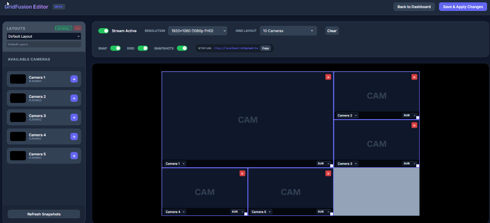

# Tonys Onvif-RTSP Server

Bridge generic RTSP cameras into NVRs like UniFi Protect. This tool acts as a proxy, giving each of your cameras a unique identity (IP/MAC) so they work correctly with Protect's requirements.


## Introducing GridFusion - Multi-Camera Matrix Composer

**GridFusion** lets you combine multiple camera feeds into a single, customizable RTSP stream. Perfect for creating security monitoring walls, multi-angle views, or consolidated feeds for your NVR.



### Key Features:
- **Visual Drag-and-Drop Editor**: Position cameras anywhere on the canvas with pixel-perfect control
- **Flexible Layouts**: Create any grid configuration - 2x2, 3x3, 4x4, or completely custom arrangements
- **Custom Resolutions**: Output at standard resolutions (1080p, 4K) or define your own dimensions
- **Live Preview**: See exactly how your matrix will look before saving. Visual camera placement using live snapshots from your feeds
- **RTSP Output**: The composed matrix is available as a standard RTSP stream that any NVR can consume


## 🐧 Ubuntu Setup (Recommended)
This server is optimized for Ubuntu 25.04. The **Virtual NIC** feature requires Linux `macvlan`.

1. **Clone and enter the folder:**
   ```bash
   git clone https://github.com/BigTonyTones/Tonys-Onvf-RTSP-Server.git
   cd Tonys-Onvf-RTSP-Server
   ```

2. **Run the startup script:**
   ```bash
   sudo chmod +x start_ubuntu_25.sh
   sudo ./start_ubuntu_25.sh
   ```
   *The script sets up a Python venv, installs dependencies (ffmpeg, etc.), and optimizes system limits.*

3. **Open the Web UI:**
   Navigate to `http://localhost:5552` to start adding cameras.

---

## 🪟 Windows Setup
1. Install Python 3.7+.
2. Run `start_onvif_server.bat`.
   *Note: Virtual NICs (unique IP/MAC per camera) are not supported on Windows. All cameras will share the host IP.*

---

## 🛠 Features & Tips
- **Unique Identities**: Use the **Virtual NIC** toggle on Linux to give each camera its own IP and MAC address.
- **UniFi Protect**: Use the ONVIF IP and credentials shown in the dashboard to manually adopt cameras in the Protect app.
- **Performance**: High-concurrency is handled via MediaMTX. No need for manual configuration.
- **Transcoding**: Only enable this if your camera's native codec isn't compatible. It is CPU intensive.
- **VMs**: If running in a VM (Proxmox, ESXi), you **must** enable **Promiscuous Mode** on the network interface for Virtual NICs to work.
- **Auto-Boot**: You can enable the systemd service in the Web UI settings to start the server on boot.

## Credits
Built using [MediaMTX](https://github.com/bluenviron/mediamtx) and [FFmpeg](https://ffmpeg.org/).

<a href="https://buymeacoffee.com/tonytones" target="_blank"></a>
